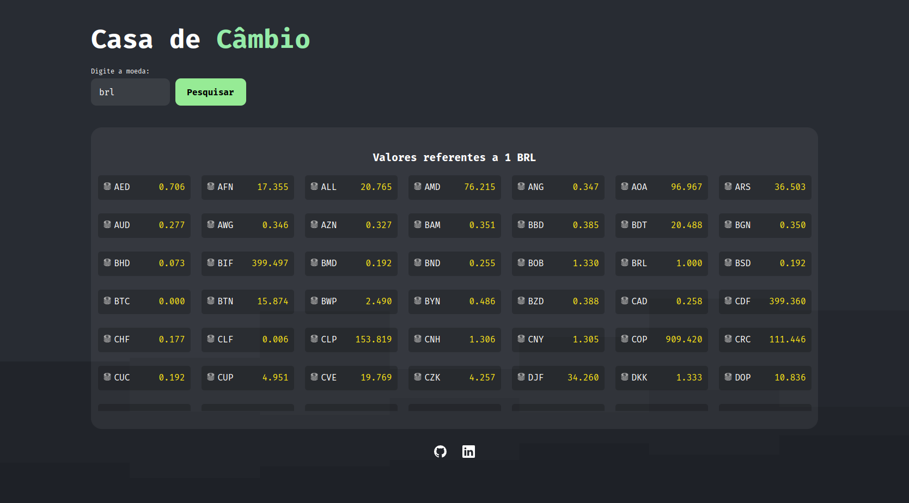

># Convert Coin

## Projeto completo!

## Sobre o projeto
        Esse projeto foi desenvolvido a fim de exercitar meus conhecimentos com assincronicidade 
        em JavaScript puro. Resolvi também upar com o Surge, uma API que facilita e agiliza o deploy 
        e upload na web. 
        Ele consiste em fazer uma conversão de moedas. Tendo um input para inserir a moeda que
        deseja procurar e um botão para fazer a busca. Ele vai fazer uma requisição através
        do "fetch" para uma API de valores de conversões de moedas (link logo abaixo), e retorna uma
        tabela com todas as moedas no formato "NOME" "VALOR".

        - API conversor: https://exchangerate.host/#/docs

># 🔗 [Acesse clicando aqui!](https://convert-coin.surge.sh)

## 👨‍💻 APRENDIZADO
- Assincronicidade.
- Retorno de API usando "fetch".
- Manipulação com DOM.
- 

## 🛠️ FERRAMENTAS USADAS 
- Vite
- Surge
- ESlint

## CONTATO

https://linkedin.com/in/luandersonalvesdev